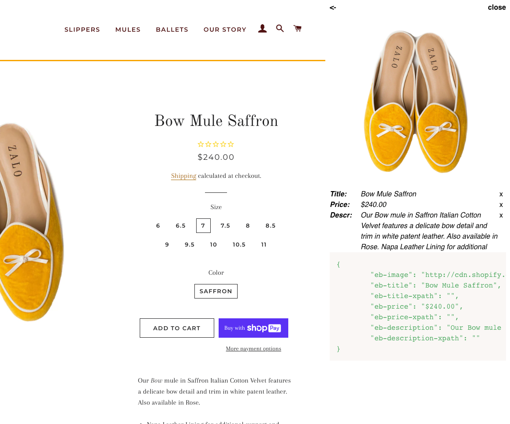

# element-blocks

可以更简单地获取网页商品信息和xpath，默认使用OpenGraph获取商品信息

## Usage

1. 启动服务
2. 拖动链接到标签栏（加入标签）
3. 在商品详情页点击标签
4. 可以右键选择元素，然后确认

## Tips

如果某个商品信息已经获取到，则不能再选择此信息，删掉此信息后可以再次选择。

## prepare

```shell
uglifyjs src/bookmark.js -c -m -o statics/bookmark.js
```

## server

```shell
./assets/httpserver
```

## screenshot
